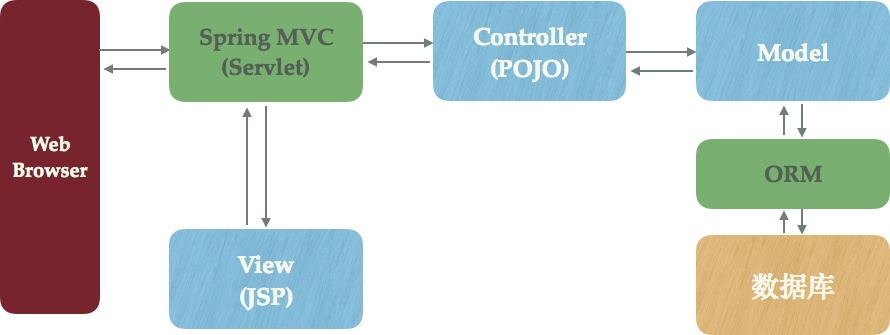

#Spring入门
##简介：
###特点：
* 	__轻量级__:  指不依赖于容器进行

* __IoC__，Inversion of Control 指控制反转或反向控制,在Spring框架中我们通过配置创建类对象，由Spring在运行阶段实例化、组装对象。

* __AOP__，Aspect Oriented Programming，面向切面编程，其思想是在执行某些代码前执行另外的代码，使程序更灵活、扩展性更好，可以随便地添加、删除某些功能。Servlet中的Filter便是一种AOP思想的实现。 

* Spring同时也是一个 __"一站式"__ 框架，即Spring在JavaEE的三层架构[表现层（Web层）、业务逻辑层（Service层）、数据访问层（DAO层）]中，每一层均提供了不同的解决技术。如下：

	_表现层_（Web层）：Spring MVC
	 _业务逻辑层_（Service层）：Spring的IoC
    	_数据访问层_（DAO层）：Spring的jdbcTemplate

------------------
###HTTP相关知识
+ 服务器发送给浏览器的响应时没有JS，CSS和图片等外部资源的，浏览器在解析响应时才会再次请求这些资源，这里会出现一些静态资源请求不到的问题，SpringMVC是怎么配置的。

----------------
###Servlet基础知识
  * __什么是ServletContext，和Tomcat等web容器的关系是什么?__
      简单的说,我们在浏览器点击链接和按钮产生的消息不是发送给Servlet的，而是发送给web容器的（在JSP出现之前，web容器也叫Servlet容器），WEB容器接收消息后不知道如何处理，转交给我们编写的Servlet容器，那么web容器时怎么和Servlet交流的呢，于是就出现了Servlet接口，接口是定义一种规范的良好表达形式，只要我们编写的java类符合Servlet规范，那么就能被web容器识别并被容器管理。

+ __什么是Session？Session在实际工程中的应用场景，以及@SessionAttribute注解的局限性__
+ JSP是面向服务器的，他并不知道浏览器是什么，是我们在写JSP时预设客户端时浏览器，JSP就是一个Servlet

+ JSP的中文比爱呢吗乱码有几种情况？各自的解决办法？JSP文件的编码 ，里蓝其的解析编码， GET请求的编码，Post的编码。
+ Servlet是一种接口规范，其中请求和响应是Servlet容器通过向方法的参数赋值HttpServletRequest或者HttpServletResponse传递的。
------------------
###各大框架基本概念：Spring/Struts/Hibernate是干什么用的？
+ __Spring：DI (IOC) / AOP__

	Spring对应的关键词是DI（依赖注入）与AOP（面向切面编程），可以认为是一个以DI和AOP为核心Java Web一站式的集成（粘合）框架。

	其中DI也称为IoC（控制发转）用于管理Java对象之间的依赖关系。AOP用于解耦业务代码和公共服务代码（如日志，安全，事务等）。DI和AOP能够让代码更加简单，具有良好的松耦合特性和可测试性，极大地简化开发。理解这两者是使用Spring框架的基础。

	Spring框架对Java企业应用开发中的各类通用问题都进行了良好的抽象，因此也能够把应用各个层次所涉及的特定的功能和开发框架（如接下来要说的MVC框架、ORM框架）方便得组合到一起（这也得益于依赖注入和面向切面编程带来的强大功能）。
	
+  __Struts：MVC__

	Struts是一个Java Web MVC开发框架。MVC早在1978年就作为Smalltalk的一种设计模式被提出来了，引用到Web应用中来时：

	- 模型Model用于封装与业务逻辑相关的数据和数据处理方法
	- 视图View是数据的HTML展现
	- 控制器Controller负责响应请求，协调Model和View
	
	MVC开发模式下，Java Web开发会遇到URL路由、模板渲染、表单绑定/提交/验证、Session封装、权限验证、国际化等一系列通用的问题，而MVC框架会将这些通用问题都封装进框架中，你在应用中根据自己的场景进行简单的配置和编码即可，MVC框架就能帮你处理好一切，可以极大地简化代码。
	
	Struts曾经是最流行的Java Web MVC框架，现在常见的选择是Spring MVC
	
+  __Hibernate：ORM__ 

	ORM是Object Relation Mapping的缩写，顾名思义，即对象关系映射。
	
	ORM是一种以面向对象的方式来进行数据库操作的技术。Web开发中常用的语言，都会有对应的ORM框架。而Hibernate就是Java开发中一种常用ORM框架，另一个现在流行的ORM框架是Mybatis。
		
	__为什么需要ORM框架__
	
	简单地理解，通过Java进行数据库访问的正常流程可以分为以下几步：
	
	-  准备好SQL语句
		-  调用JDBC的API传入SQL语句，设置参数
  		- 解析JDBC返回的结果
  		
  		这个过程实际上非常麻烦，比如：
    
	-  在Java代码中拼接SQL非常麻烦，而且易于出错
		- JDBC的代码调用有很多重复性的代码
	-  从JDBC返回的结果转换成领域模型的Java对象很繁琐

	而使用ORM框架，则可以让我们用面向对象的方式来操作数据库，比如通过一个简单的函数调用就完成上面整个流程，直接返回映射为Java对象的结果。这个流程中很大一部分工作其实可以交给ORM自动化地帮我们执行。对，类似MVC框架，ORM框架会帮你处理好相关的繁琐事情！

- MVC框架（以Spring MVC为例）和ORM

Spring MVC提供了一个DispacherServlet（可以Spring MVC是以Servlet技术为基础的），这个Servlet把Web应用中Servlet中经常要实现的功能封装起来并提供一层公共抽象，想象对应于一个Web请求后端要做的事情，比如：
	- URL映射（对应HTTP URL和方法，应该调用什么代码）
	- 权限验证（当前的URL是否允许当前用户访问）
	- 参数解析（如何从Servlet中获得参数）
	- 数据绑定（如何将Servlet中的参数，绑定到业务逻辑对象中）
	 - 数据验证（判断数据是否符合业务规则，比如邮件格式是否正确）
	- 视图解析（使用哪个视图模板进行渲染）模型传递与视图渲染（将数据传递给模板，并且在模板中引用）

	有了Spring MVC，你只需写简单的POJO代码（如图所示，用POJO实现Controller），或者实现Spring MVC给你提供的接口（比如实现Interceptor做权限判断），就能完成这些繁琐的功能。
	
	而ORM的作用就非常直观了，无须赘述，如图所示它提供了与数据库操作的一层中间抽象，这样Model的代码自然会更加简单。Spring MVC基本可以帮你屏蔽Servlet的API，ORM则可以帮你屏蔽JDBC的API了，也就是说你在更高的抽象层次上写程序了，更高的抽象层次一般意味着以更符合我们思维的方式来思考，自然效率更高。这事实上是软件技术发展的一个重要驱动力之一。你想想，从汇编语言发展出高级语言，从文件系统发展出数据库，其实本质规律是类似的。

	__那Spring的作用是什么呢？ 看到图中大量的箭头没有？__
	
	图中的每一个小方块其实都是大量的Java类来实现，Controller与Model之间，Model与数据访问对象之间的这些箭头，意味这些Java类之间存在大量复杂的依赖关系。Spring的核心功能依赖注入，正是用于管理Java对象之间的依赖关系，所以第一部分我们说Spring是一个一站式的粘合框架，它像神奇的胶水一样，可以以松耦合的方式有机的粘合在一起。

-----
###Spring重点
- __ioc的意义是什么？__

	面试的时候有人说是减少代码，这样的人是完全不懂。最起码答复到解耦，更加完整的是和AOP的关系，没有ioc就没有AOP，IOC相对于掐住了咽喉，对象是他创建的，他想干嘛就干嘛，才能实现AOP，才能增强特性。

- __AOP是如何实现的__

	代理是思想，是接口，实现的方法有JDK的动态代理和CGLIB代理，CGLIB代理是继承产生了一个子类，在前后增加特性达到目的。接下来思考为什么不能切static，private，final方法？接下来思考AopContext.currentProxy()是如何实现的？

- __bean的作用域__

	ioc既然是spring的最重要的东西，那bean的作用域自然也不能忽视了。知道有哪几种作用域，看看是如何实现的，使用的场景。最后再自定义作用域测试一下。思考一下为什么controller里面注入HttpServletRequest request，请求并发的时候不会有冲突？你就会发现和AOP脱离不了关系！

- __spring有哪些扩展点__

	每一个都测试一遍，有些觉得很奇怪，思考一下为什么？每一个都会用了之后，你就会发现自己间接就对spring了解加深了！

-------
###学习时注意些什么？
- __带着这样的疑问__

	- 这个框架是负责哪一块的，用在哪一层？
- 没有它之前，前辈们如何解决，又什么缺点？
- 它的出现解决了哪些痛点？
- 它是否也有什么缺点？（这个暂时不作要求）

- __例子__：MyBatis是对JDBC的封装，负责和数据库打交道，我们在dao层会用到它。
	- MyBatis出现之前，我们可以用Hibernate框架，一个非常优秀的ORM框架。 
	- 但是在Hibernate更早更早之前的上古时代，我们的程序猿祖先就用JDBC。
	- 但是JDBC的缺点也十分明显：
	
	
	- 所以后来我们都很少在dao层手写JDBC，而是用封装了JDBC的框架，比如轻量而优秀的MyBatis。
	- 这里顺便简单对比下Hibernate和MyBatis。因为同为dao层框架，它们总是被人拿来比较：
	
	
	- MyBatis解决了JDBC的哪些痛点呢：
	
	
	
- 另外，Spring最核心的概念就两个：AOP（切面编程）和DI（依赖注入）。DI又依赖IoC。

这里不打算详细说，就简单画个图，只介绍DI和IoC。
	
