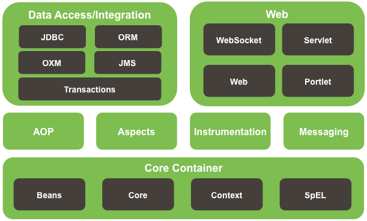

# Spring 1  mvw
## Spring是什么
- Spring是一个开源框架
- Spring为了简化企业级应用开发而生，使用Spring可以使简单的JavaBean实现以前只有EJB才能实现的功能
（针对举个例子：声明式事物，以前在EJB二中需要经过繁琐的配置和复杂的代码实现，Spring中实现声明式事物是非常愉悦的）
- Spring是一个IOC（DI）反转控制/依赖注入 和AOP（面向切面编程）容器框架
- 具体描述Spring
    + 轻量级：Spring是非侵入性的，基于Spring开发的应用中的对象可以不依赖于Spring的API(用Spring的时候，不需要实现Spring提供的任何接口，不需要继承Spring提供的父类，就可以享用Spring提供的功能)
    + 依赖注入（DI/IOC）
    +  面向切面编程（AOP）
    +  容器：是一个容器，因为它包含并且管理应用对象的声明周期
    +  框架：Spring实现了使用简单的组件配置组合成一个复杂的应用在Spring中可以使用XML和Java注解组合这些对象
    +  一站式：在IOC和AOP的基础上可以整合各种企业应用的开源框架和优秀的第三方类库（实际上Spring自身也提供了展现曾层的springMVC和持久层的SpringMVC）
- Spring模块


    + 最底层是Spring的核心容器
        + 配置beans
        + core
        + 上下文：context
        + SpEL:Spring的EL表达式
    + AOP Aspects：面向切面编程； Instruction：整合；Massaging：消息。
    + 面向切面编程上边马上可以实现的就是声明式事物（JDBC ORM）
    + 整合和消息上边就可以用到SpringMvc等整合
## Spring HelloWord(Eclipse)
- 安装插件：Spring Tool Suite
- 搭建Spring开发环境
- helloword 
   - 普通helloworld
      1.   创建HelloWorld对象
      	- 为name属性
      	- 调用hello方法
      - 在Spring中，前两步交给Spring来做
        1. Springbean的配置文件
        - 创建Spring的IOC的容器对象

        - 从IOC容器中获取

        - 调用hello方法

          ```java
          //创建Spring的IOC的容器对象
          ApplicationContext ctx=new ClassPathXmlApplicationContext("applicationContext.xml");
          //从IOC容器中获取bean实例
          HelloWorld helloworld = (HelloWorld)ctx.getBean("id")；
          //调用hello方法
          helloworld.hello();
          ```

          ​	 ApplicationContext代表SpringIOC容器，是一个接口.ClassPathXmlApplicationContext表示配置文件在类路径下，是 ApplicationContext的一个实现类，里边传入的是配置文件的名字。

          在创建这个容器ctx的时候，它会调用构造器和set方法对xml文件的bean进行初始化。


