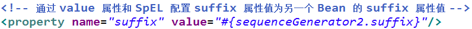
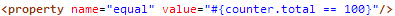

##配置Bean---自动装配
-  XML 配置里的 Bean 自动装配
	- Spring IOC 容器可以自动装配 Bean. 需要做的仅仅是在 <bean> 的 autowire 属性里指定自动装配的模式
	- byType(根据类型自动装配): 若 IOC 容器中有多个与目标 Bean 类型一致的 Bean. 在这种情况下, Spring 将无法判定哪个 Bean 最合适该属性, 所以不能执行自动装配. 
	- byName(根据名称自动装配): 根据bean的名字和当前的setter风格的属性名进行自动装配，若有匹配的，则进行自动装配，若没有匹配的，则不匹配。必须将目标 Bean 的名称和属性名设置的完全相同.
	- constructor(通过构造器自动装配): 当 Bean 中存在多个构造器时, 此种自动装配方式将会很复杂. 不推荐使用
- XML 配置里的 Bean 自动装配的缺点
	- 在 Bean 配置文件里设置 autowire 属性进行自动装配将会装配 Bean 的所有属性. 然而, 若只希望装配个别属性时, autowire 属性就不够灵活了. 
	- autowire 属性要么根据类型自动装配, 要么根据名称自动装配, 不能两者兼而有之.
	- 一般情况下，在实际的项目中很少使用自动装配功能，因为和自动装配功能所带来的好处比起来，明确清晰的配置文档更有说服力一些
	
##Bean之间的以来关系：依赖 继承
- 继承 Bean 配置
	- Spring 允许继承 bean 的配置, 被继承的 bean 称为父 bean. 继承这个父 Bean 的 Bean 称为子 Bean
	- 子 Bean 从父 Bean 中继承配置, 包括 Bean 的属性配置
	- 子 Bean 也可以覆盖从父 Bean 继承过来的配置
	- 父 Bean 可以作为配置模板, 也可以作为 Bean 实例. 若只想把父 Bean 作为模板, 可以设置` <bean>` 的abstract 属性为 true, 这样 Spring 将不会实例化这个 Bean
	- 并不是 `<bean> `元素里的所有属性都会被继承. 比如: autowire, abstract 等.
	- 也可以忽略父 Bean 的 class 属性, 让子 Bean 指定自己的类, 而共享相同的属性配置. 但此时 abstract 必须设为 true
- 依赖 Bean 配置
	- Spring 允许用户通过 depends-on 属性设定 Bean 前置依赖的Bean，前置依赖的 Bean 会在本 Bean 实例化之前创建好
	- 如果前置依赖于多个 Bean，则可以通过逗号，空格或的方式配置 Bean 的名称

##bean 的作用域：singleton；prototype；WEB 环境作用域
- Bean 的作用域
	- 在 Spring 中, 可以在 <bean> 元素的 scope 属性里设置 Bean 的作用域. 
	- 默认情况下, Spring 只为每个在 IOC 容器里声明的 Bean 创建唯一一个实例, 整个 IOC 容器范围内都能共享该实例：所有后续的 getBean() 调用和 Bean 引用都将返回这个唯一的 Bean 实例.该作用域被称为 singleton, 它是所有 Bean 的默认作用域.
	
##使用外部属性文件

- 在配置文件里配置 Bean 时, 有时需要在 Bean 的配置里混入系统部署的细节信息(例如: 文件路径, 数据源配置信息等). 而这些部署细节实际上需要和 Bean 配置相分离
- Spring 提供了一个 PropertyPlaceholderConfigurer 的 BeanFactory 后置处理器, 这个处理器允许用户将 Bean 配置的部分内容外移到属性文件中. 可以在 Bean 配置文件里使用形式为 ${var} 的变量, PropertyPlaceholderConfigurer 从属性文件里加载属性, 并使用这些属性来替换变量.
- Spring 还允许在属性文件中使用 ${propName}，以实现属性之间的相互引用。
- 注册 PropertyPlaceholderConfigurer 
- Spring 2.0:

- Spring 2.5 之后: 可通过 <context:property-placeholder> 元素简化:
<beans> 中添加 context Schema 定义
在配置文件中加入如下配置: 

##spEL 
- Spring 表达式语言（简称SpEL）：是一个支持运行时查询和操作对象图的强大的表达式语言。
- 语法类似于 EL：SpEL 使用 #{…} 作为定界符，所有在大框号中的字符都将被认为是 SpEL
- SpEL 为 bean 的属性进行动态赋值提供了便利
	- 通过 SpEL 可以实现：
	- 通过 bean 的 id 对 bean 进行引用
	- 调用方法以及引用对象中的属性
	- 计算表达式的值
	- 正则表达式的匹配
- SpEL：字面量
	- 字面量的表示：
		- 整数：```<property name="count" value="#{5}"/>```
		- 小数：```<property name="frequency" value="#{89.7}"/>```
		- 科学计数法：```<property name="capacity" value="#{1e4}"/>```
		- String可以使用单引号或者双引号作为字符串的定界符号：```<property name=“name” value="#{'Chuck'}"/>``` 或 ```<property name='name' value='#{"Chuck"}'/>```
		- Boolean：<property name="enabled" value="#{false}"/>
- SpEL：引用 Bean、属性和方法（1）
	- 引用其他对象：


	- 引用其他对象的属性


	- 调用其他方法，还可以链式操作

- SpEL支持的运算符号（1）
- 算数运算符：+, -, *, /, %, ^：


加号还可以用作字符串连接：


比较运算符： <, >, ==, <=, >=, lt, gt, eq, le, ge


- SpEL支持的运算符号（2）
逻辑运算符号： and, or, not, |


if-else 运算符：?: (ternary), ?: (Elvis)


if-else 的变体


正则表达式：matches


- SpEL：引用 Bean、属性和方法（2）
0 调用静态方法或静态属性：通过 T() 调用一个类的静态方法，它将返回一个 Class Object，然后再调用相应的方法或属性： 

##IOC 容器中 Bean 的生命周期##
Spring 4.x 新特性：泛型依赖注入